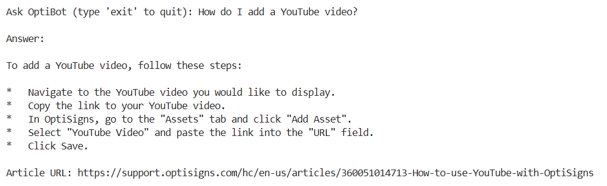

## Scrape ⇒ Markdown
- Pulls articles from support.optisigns.com via Zendesk Help Center API
- Retrieves at least 30 articles
- Removes navigation, footer, and non-article elements
- Converts HTML content into clean Markdown
- Saves each article as a separate `<slug>.md` file

## Tech Stack
- Node.js
- Axios (Zendesk API requests)
- JSDOM (HTML parsing & cleanup)
- Turndown (HTML → Markdown)
- Slugify (generate URL-safe filenames)

## How to Run Locally
```bash
npm install
node index.js
Markdown files will be generated in `data/articles/`
```

## Build Assistant & Programmatically Load Vector Store

**RAG Pipeline:**

1. Markdown articles are loaded and chunked
2. Text chunks are embedded using Sentence Transformers
3. Embeddings are stored in a FAISS vector database
4. User questions retrieve relevant chunks
5. A Groq-hosted LLM generates answers using retrieved context

## Chunking Strategy

- Documents are split into chunks of 500 characters
- Overlap of 100 characters is used to preserve context across chunks
- This approach balances retrieval accuracy and performance

## Tech Stack

- **Language:** Python 3.13.5
- **LLM:** Groq (Llama 3)
- **Embeddings:** `sentence-transformers/all-MiniLM-L6-v2`
- **Vector Database:** FAISS
- **Framework:** LangChain

## Sanity Check Result

The assistant correctly answered the test question using retrieved documentation.

